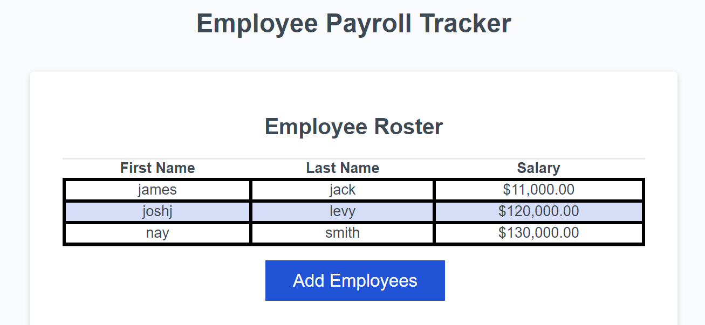

# work-payroll

Our task for this project, was to debug given code to create an employee payroll tracker. This project displays a simple "Employee Roster" table, and prompt the user to add their employees first and last name, as well as their salary.  

The program displays the employees first name, last name, and salary, then console.logs the average employee salary and picks a random draw winner!

# User Story

AS A payroll manager  
I WANT AN employee payroll tracker  
SO THAT I can see my employees' payroll data and properly budget for the company 

# Acceptance Criteria

GIVEN an employee payroll tracker  
WHEN I click the "Add employee" button  
THEN I am presented with a series of prompts asking for first name, last name, and salary  
WHEN I finish adding an employee  
THEN I am prompted to continue or cancel  
WHEN I choose to continue  
THEN I am prompted to add a new employee  
WHEN I choose to cancel  
THEN my employee data is displayed on the page sorted alphabetically by last name, and the console shows computed and aggregated data

---

---
[Website Link](https://authorixed.github.io/employee-tracker/)